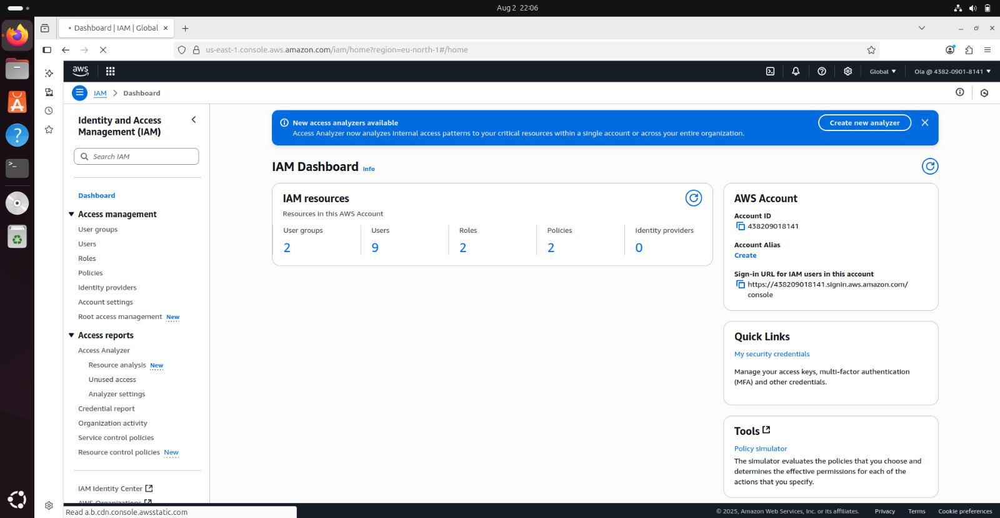

# AWS IAM Management Script
Project Scenario
CloudOps Solutions is a growing company that recently adopted AWS to manage its cloud infrastructure. As the company scales, they have decided to automate the process of managing AWS Identity and Access Management (IAM) resources. This includes the creation of users, user groups, and the assignment of permissions for new hires, especially for their DevOps team.

Project Deliverables: 

This document serves as the comprehensive documentation detailing the thought process and the final extended script, fulfilling all project requirements.

Extended Script: 
## aws-iam-manager.sh
Below is the completed shell script that automates the creation of IAM users, an admin group, and the assignment of administrative privileges.


Download

[AWS IAM MANAGER SCRIPT ](aws-iam-manager.sh)
```
#!/bin/bash

# AWS IAM Manager Script for CloudOps Solutions
# This script automates the creation of IAM users, groups, and permissions

# Define IAM User Names Array
IAM_USER_NAMES=("user1" "user2" "user3" "user4" "user5")

# Function to create IAM users
create_iam_users() {
    echo "Starting IAM user creation process..."
    echo "-------------------------------------"
    
    # Iterate through the array and create each user
    for user_name in "${IAM_USER_NAMES[@]}"; do
        echo "Creating IAM user: $user_name"
        aws iam create-user --user-name "$user_name"
        
        if [ $? -eq 0 ]; then
            echo "Success: User '$user_name' created."
        else
            echo "Error: Failed to create user '$user_name'. It may already exist."
        fi
    done
    
    echo "------------------------------------"
    echo "IAM user creation process completed."
    echo ""
}

# Function to create admin group and attach policy
create_admin_group() {
    echo "Creating admin group and attaching policy..."
    echo "--------------------------------------------"
    
    # Check if group already exists to prevent an error
    aws iam get-group --group-name "admin" >/dev/null 2>&1
    if [ $? -ne 0 ]; then
        echo "Creating IAM group: admin"
        aws iam create-group --group-name "admin"
        if [ $? -eq 0 ]; then
            echo "Success: IAM group 'admin' created."
        else
            echo "Error: Failed to create group 'admin'."
            exit 1
        fi
    else
        echo "IAM group 'admin' already exists. Skipping creation."
    fi
    
    # Attach AdministratorAccess policy
    echo "Attaching AdministratorAccess policy..."
    # AWS-managed policy ARN for AdministratorAccess
    ADMIN_POLICY_ARN="arn:aws:iam::aws:policy/AdministratorAccess"
    aws iam attach-group-policy --group-name "admin" --policy-arn "$ADMIN_POLICY_ARN"
    
    if [ $? -eq 0 ]; then
        echo "Success: AdministratorAccess policy attached"
    else
        echo "Error: Failed to attach AdministratorAccess policy"
    fi
    
    echo "----------------------------------"
    echo ""
}

# Function to add users to admin group
add_users_to_admin_group() {
    echo "Adding users to admin group..."
    echo "------------------------------"
    
    # Iterate through the array and add each user to the admin group
    for user_name in "${IAM_USER_NAMES[@]}"; do
        echo "Adding user '$user_name' to group 'admin'."
        aws iam add-user-to-group --group-name "admin" --user-name "$user_name"
        
        if [ $? -eq 0 ]; then
            echo "Success: User '$user_name' added to group 'admin'."
        else
            echo "Error: Failed to add user '$user_name' to group 'admin'. User or group may not exist."
        fi
    done
    
    echo "----------------------------------------"
    echo "User group assignment process completed."
    echo ""
}

# Main execution function
main() {
    echo "=================================="
    echo " AWS IAM Management Script"
    echo "=================================="
    echo ""
    
    # Verify AWS CLI is installed and configured
    if ! command -v aws &> /dev/null; then
        echo "Error: AWS CLI is not installed. Please install and configure it first."
        exit 1
    fi
    
    # Execute the functions
    create_iam_users
    create_admin_group
    add_users_to_admin_group
    
    echo "=================================="
    echo " AWS IAM Management Completed"
    echo "=================================="
}
# Execute main function
main

exit 0
```

1. Prerequisites and Setup
Before running the script, ensure you have the AWS CLI installed and configured. This is a critical first step.

Action: Install the AWS CLI if it's not already on your system.

Command: curl "https://awscli.amazonaws.com/awscli-exe-linux-x86_64.zip" -o "awscliv2.zip" && unzip awscliv2.zip && sudo ./aws/install (for Linux) or refer to the official AWS documentation for your OS.

Action: Configure the AWS CLI with your credentials.

Command: aws configure


2. Creating the Script File
Create a new file named aws-iam-manager.sh and make it executable.

Action: Create the file using a text editor (e.g., nano, vim) or the touch command.

Command: touch aws-iam-manager.sh

Action: Open the file and paste the complete script provided above.

Action: Grant execute permissions to the script.

Command: chmod +x aws-iam-manager.sh


3. Defining IAM Users
The first step in the script is to define the DevOps user names.

Action: In the aws-iam-manager.sh file, the IAM_USER_NAMES array is populated with five unique user names. This allows for easy management and iteration.

Code Snippet:

IAM_USER_NAMES=("devops-user1" "devops-user2" "devops-user3" "devops-user4" "devops-user5")


4. Creating IAM Users
The create_iam_users function uses a for loop to iterate through the array and creates each user.

Action: The script calls aws iam create-user --user-name "$user_name" for each name in the IAM_USER_NAMES array.

Code Snippet:

for user_name in "${IAM_USER_NAMES[@]}"; do
    echo "Creating IAM user: $user_name"
    aws iam create-user --user-name "$user_name"
    ...
done


5. Creating the admin Group and Attaching the Policy
The create_admin_group function creates the admin group and attaches the AdministratorAccess policy to it.

Action: The script first checks if the group exists to avoid an error. It then creates the group using aws iam create-group.

Action: It then attaches the AdministratorAccess policy to the newly created admin group using the policy's ARN. The ARN for AdministratorAccess is arn:aws:iam::aws:policy/AdministratorAccess.

Code Snippet:

# Create the admin group
aws iam create-group --group-name "admin"

# Attach AdministratorAccess policy
ADMIN_POLICY_ARN="arn:aws:iam::aws:policy/AdministratorAccess"
aws iam attach-group-policy --group-name "admin" --policy-arn "$ADMIN_POLICY_ARN"


6. Adding Users to the admin Group
The add_users_to_admin_group function iterates through the user names and adds them to the admin group.

Action: A for loop is used to call aws iam add-user-to-group for each user, specifying both the group name and the user name.

Code Snippet:

for user_name in "${IAM_USER_NAMES[@]}"; do
    echo "Adding user '$user_name' to group 'admin'."
    aws iam add-user-to-group --group-name "admin" --user-name "$user_name"
    ...
done


7. Running the Script
With the script completed and prerequisites met, you can now execute it.

Action: Run the script from your terminal.

Command: ./aws-iam-manager.sh

Screenshot Location: Place a screenshot here showing the terminal output as the script runs. The output should show the creation of each user, the creation of the group, and the successful assignment of each user to the group.


8. Verification in the AWS Console
The final step is to verify that all resources were created correctly by checking the AWS IAM console.

Action: Log in to the AWS Management Console and navigate to the IAM service.

Action: Check the "Users" section to see the five new DevOps users.



Action: Navigate to the "User groups" section and click on the "admin" group.

Action: Verify that the AdministratorAccess policy is attached and that all five users are members of the group.


